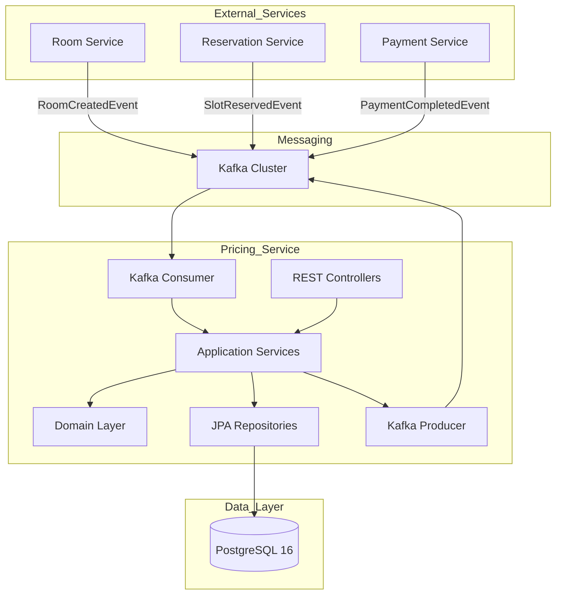
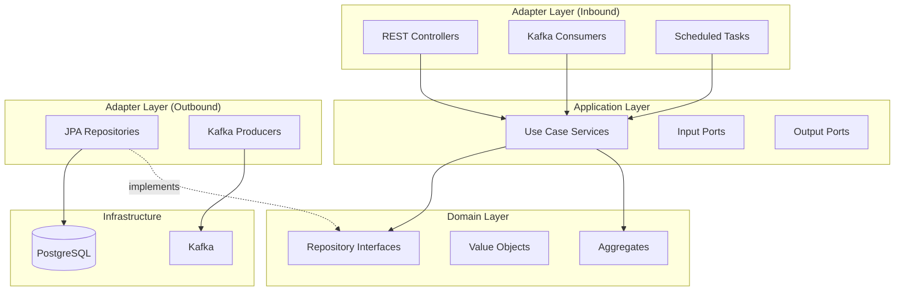
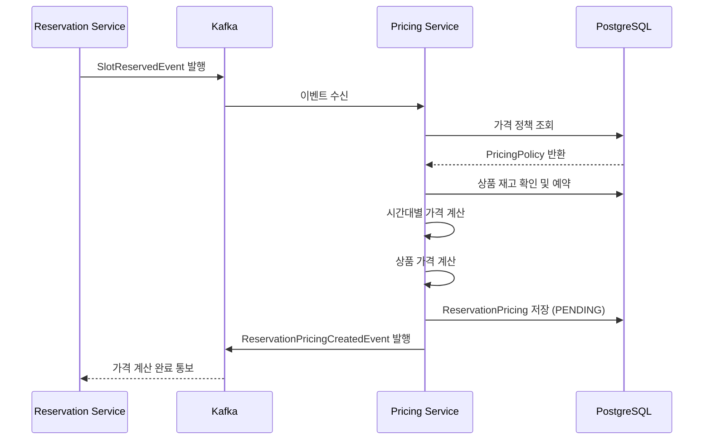
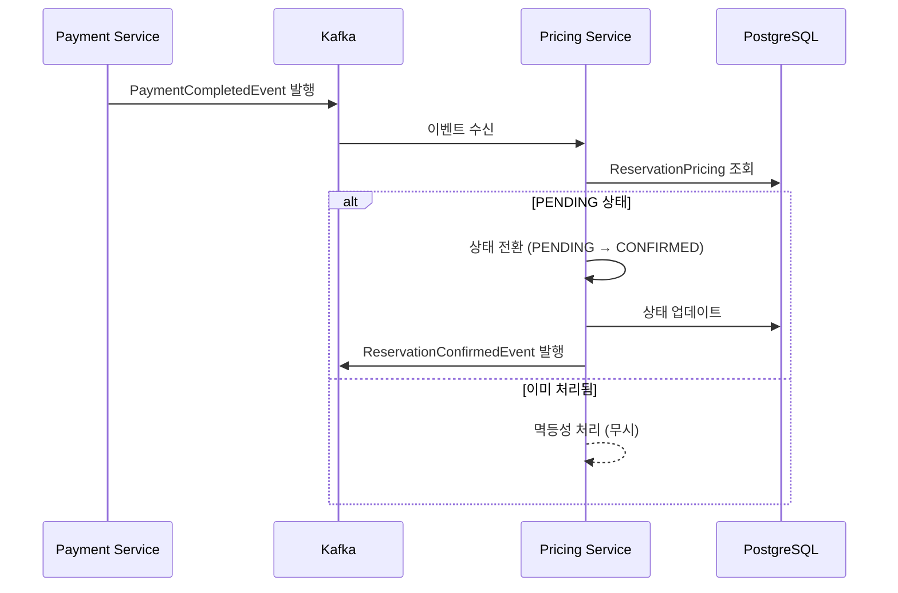
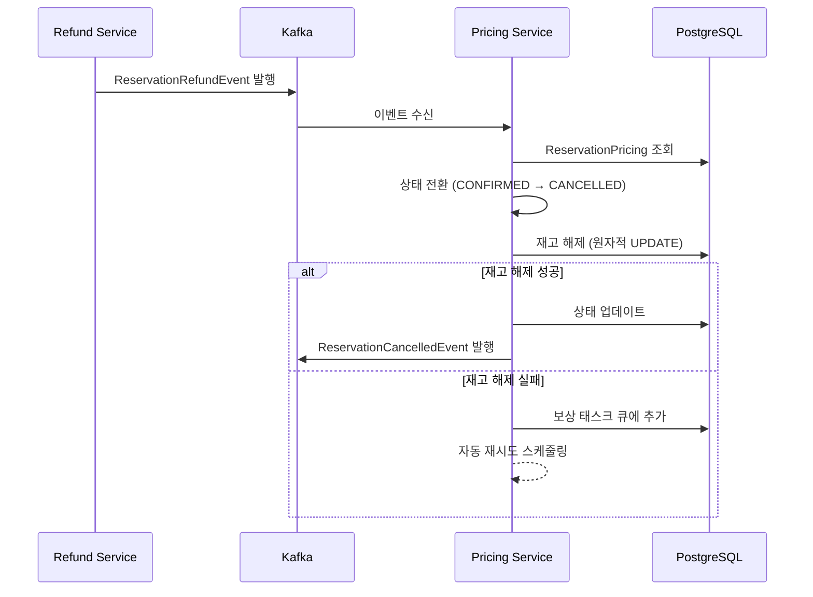
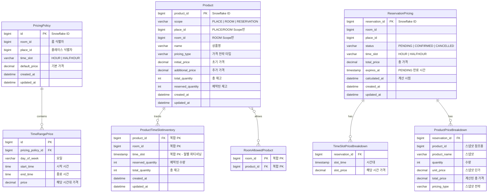
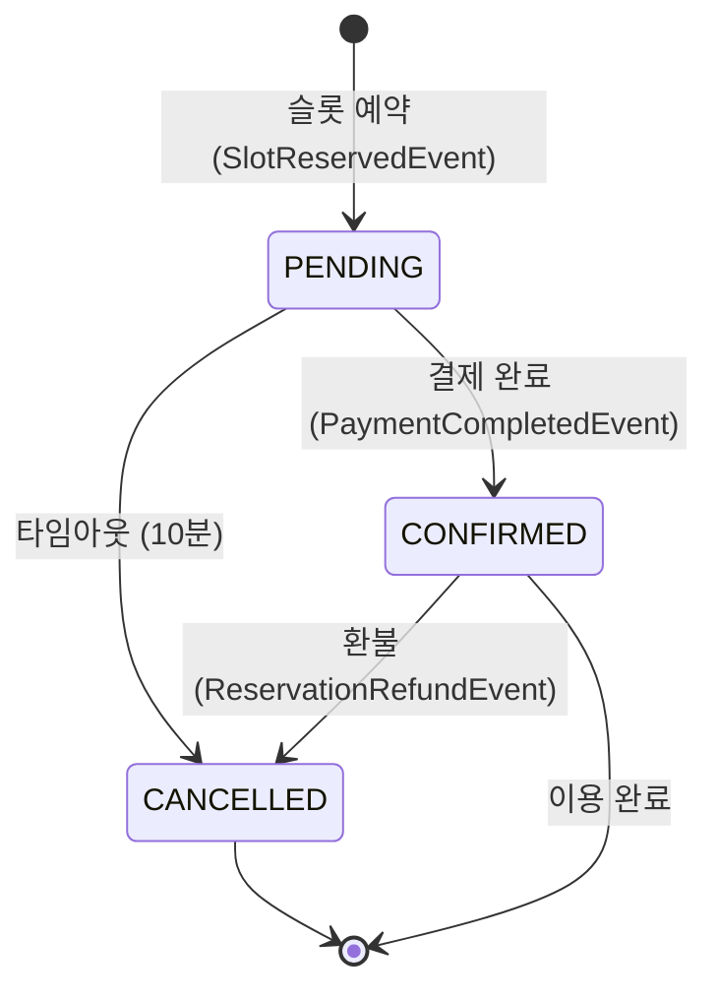

# 예약 가격 관리 서비스 가이드 문서

## 1. 개요

### 1.1 목적

예약 가격 관리 서비스(Reservation Pricing Service)는 플랫폼 내 공간 예약 시스템에서 가격 정책 관리, 추가상품 관리, 예약 가격 계산을 담당하는 마이크로서비스이다.

### 1.2 주요 기능

| 기능 | 설명 |
|------|------|
| 가격 정책 관리 | 룸별 시간대/요일별 차등 가격 설정 |
| 추가상품 관리 | PLACE/ROOM/RESERVATION 범위별 상품 관리 |
| 가격 계산 전략 | 초기+추가, 일회성, 단순재고 3가지 전략 |
| 재고 관리 | 시간대별 원자적 재고 예약/해제 |
| 예약 가격 스냅샷 | 예약 시점 가격 불변 저장 |
| 예약 상태 관리 | PENDING → CONFIRMED → CANCELLED 전이 |
| 배치 가격 조회 | Place/Room ID 리스트 기반 일괄 조회 |
| 이벤트 처리 | Kafka 기반 비동기 이벤트 수신/발행 |

### 1.3 기술 스택

| 구분 | 기술 |
|------|------|
| Framework | Spring Boot 3.2.5 |
| Language | Java 21 LTS (Virtual Threads) |
| Database | PostgreSQL 16 |
| Message Broker | Apache Kafka 3.6 |
| Build Tool | Gradle 8.14 |
| Architecture | Hexagonal Architecture + DDD |
| ID Generator | Snowflake ID |
| Migration | Flyway |
| Testing | JUnit 5, Testcontainers 1.19.3 |

---

## 2. 시스템 아키텍처

### 2.1 전체 구조



### 2.2 레이어 아키텍처 (Hexagonal)



### 2.3 예약 가격 계산 흐름



### 2.4 예약 확정 흐름



### 2.5 예약 취소/환불 흐름



---

## 3. 데이터 모델

### 3.1 ERD



### 3.2 테이블 상세

#### pricing_policies (가격 정책)

| 필드 | 타입 | 필수 | 설명 |
|------|------|------|------|
| id | BIGINT | Y | Snowflake ID |
| room_id | BIGINT | Y | 룸 식별자 |
| place_id | BIGINT | Y | 플레이스 식별자 |
| time_slot | VARCHAR(20) | Y | HOUR, HALFHOUR |
| default_price | DECIMAL(15,2) | Y | 기본 시간당 가격 |
| created_at | TIMESTAMP | N | 생성 시간 |
| updated_at | TIMESTAMP | N | 수정 시간 |

#### products (추가상품)

| 필드 | 타입 | 필수 | 설명 |
|------|------|------|------|
| product_id | BIGINT | Y | Snowflake ID |
| scope | VARCHAR(20) | Y | PLACE, ROOM, RESERVATION |
| place_id | BIGINT | N | PLACE/ROOM Scope 시 필수 |
| room_id | BIGINT | N | ROOM Scope 시 필수 |
| name | VARCHAR(100) | Y | 상품명 |
| pricing_type | VARCHAR(30) | Y | 가격 전략 타입 |
| initial_price | DECIMAL(15,2) | Y | 초기/기본 가격 |
| additional_price | DECIMAL(15,2) | N | 추가 가격 |
| total_quantity | INTEGER | Y | 총 재고 수량 |
| reserved_quantity | INTEGER | Y | 예약된 수량 (동시성 제어) |
| created_at | TIMESTAMP | N | 생성 시간 |
| updated_at | TIMESTAMP | N | 수정 시간 |

#### product_time_slot_inventory (시간대별 재고)

| 필드 | 타입 | 필수 | 설명 |
|------|------|------|------|
| product_id | BIGINT | Y | PK, FK |
| room_id | BIGINT | Y | PK |
| time_slot | TIMESTAMP | Y | PK, 파티션 키 |
| reserved_quantity | INTEGER | Y | 예약된 수량 |
| total_quantity | INTEGER | Y | 총 재고 |
| created_at | TIMESTAMP | N | 생성 시간 |
| updated_at | TIMESTAMP | N | 수정 시간 |

**파티셔닝:** 월별 RANGE 파티셔닝 적용 (pg_partman 자동 관리)

#### reservation_pricings (예약 가격 스냅샷)

| 필드 | 타입 | 필수 | 설명 |
|------|------|------|------|
| reservation_id | BIGINT | Y | Snowflake ID |
| room_id | BIGINT | Y | 룸 식별자 |
| place_id | BIGINT | Y | 플레이스 식별자 |
| status | VARCHAR(20) | Y | PENDING, CONFIRMED, CANCELLED |
| time_slot | VARCHAR(20) | Y | HOUR, HALFHOUR |
| total_price | DECIMAL(15,2) | Y | 총 예약 가격 |
| expires_at | TIMESTAMP | N | PENDING 만료 시간 |
| calculated_at | TIMESTAMP | Y | 가격 계산 시점 |
| created_at | TIMESTAMP | N | 생성 시간 |
| updated_at | TIMESTAMP | N | 수정 시간 |

#### room_allowed_products (룸별 허용 상품)

| 필드 | 타입 | 필수 | 설명 |
|------|------|------|------|
| room_id | BIGINT | Y | PK |
| product_id | BIGINT | Y | PK, FK |

---

## 4. API 명세

### 4.1 가격 정책 API

#### 가격 정책 조회

```
GET /api/pricing-policies/{roomId}
```

**Response**

```json
{
  "roomId": 1,
  "placeId": 100,
  "timeSlot": "HOUR",
  "defaultPrice": 10000,
  "timeRangePrices": [
    {
      "dayOfWeek": "MONDAY",
      "startTime": "14:00",
      "endTime": "21:00",
      "price": 15000
    }
  ]
}
```

#### 기본 가격 업데이트

```
PUT /api/pricing-policies/{roomId}/default-price
```

**Request**

```json
{
  "defaultPrice": 12000
}
```

#### 시간대별 가격 업데이트

```
PUT /api/pricing-policies/{roomId}/time-range-prices
```

**Request**

```json
{
  "timeRangePrices": [
    {
      "dayOfWeek": "SATURDAY",
      "startTime": "09:00",
      "endTime": "18:00",
      "price": 18000
    }
  ]
}
```

#### 가격 정책 복사

```
POST /api/pricing-policies/{targetRoomId}/copy
```

**Request**

```json
{
  "sourceRoomId": 1
}
```

**비즈니스 규칙:** 동일 Place 내 Room 간만 복사 가능

#### 배치 가격 조회 (Place 기준)

```
GET /api/pricing-policies/batch/places
```

**Query Parameters**

| 파라미터 | 타입 | 필수 | 설명 |
|---------|------|------|------|
| placeIds | List\<Long\> | Y | Place ID 목록 |

#### 배치 가격 조회 (Room 기준)

```
GET /api/pricing-policies/batch/rooms
```

**Query Parameters**

| 파라미터 | 타입 | 필수 | 설명 |
|---------|------|------|------|
| roomIds | List\<Long\> | Y | Room ID 목록 |

### 4.2 추가상품 API

#### 상품 등록

```
POST /api/v1/products
```

**Request**

```json
{
  "scope": "PLACE",
  "placeId": 100,
  "name": "빔프로젝터",
  "pricingType": "SIMPLE_STOCK",
  "initialPrice": 30000,
  "totalQuantity": 5
}
```

**Response**

```json
{
  "productId": 1234567890123456789,
  "scope": "PLACE",
  "placeId": 100,
  "name": "빔프로젝터",
  "pricingType": "SIMPLE_STOCK",
  "initialPrice": 30000,
  "totalQuantity": 5
}
```

**상태 코드**

| 코드 | 설명 |
|------|------|
| 201 | 등록 성공 |
| 400 | Scope와 ID 조합 오류 |

#### 상품 조회

```
GET /api/v1/products/{productId}
```

#### 상품 수정

```
PUT /api/v1/products/{productId}
```

#### 상품 삭제

```
DELETE /api/v1/products/{productId}
```

#### 상품 가용성 조회

```
GET /api/products/availability
```

**Query Parameters**

| 파라미터 | 타입 | 필수 | 설명 |
|---------|------|------|------|
| roomId | Long | Y | 룸 ID |
| placeId | Long | Y | 플레이스 ID |
| timeSlots | List\<LocalDateTime\> | Y | 예약 시간대 목록 |

**Response**

```json
{
  "availableProducts": [
    {
      "productId": 1,
      "name": "빔프로젝터",
      "scope": "PLACE",
      "totalQuantity": 5,
      "availableQuantity": 3,
      "pricingType": "SIMPLE_STOCK",
      "initialPrice": 30000
    }
  ]
}
```

#### 룸별 허용 상품 조회

```
GET /api/products/room/{roomId}
```

### 4.3 예약 가격 API

#### 예약 가격 생성

```
POST /api/reservations/pricing
```

**Request**

```json
{
  "reservationId": 1234567890,
  "roomId": 1,
  "placeId": 100,
  "timeSlots": [
    "2025-01-15T10:00:00",
    "2025-01-15T11:00:00",
    "2025-01-15T12:00:00"
  ],
  "products": [
    {
      "productId": 1,
      "quantity": 1
    }
  ]
}
```

**Response**

```json
{
  "reservationId": 1234567890,
  "roomId": 1,
  "placeId": 100,
  "status": "PENDING",
  "timeSlotPrices": [
    {
      "slotTime": "2025-01-15T10:00:00",
      "price": 10000
    },
    {
      "slotTime": "2025-01-15T11:00:00",
      "price": 10000
    },
    {
      "slotTime": "2025-01-15T12:00:00",
      "price": 15000
    }
  ],
  "productPrices": [
    {
      "productId": 1,
      "productName": "빔프로젝터",
      "quantity": 1,
      "unitPrice": 30000,
      "totalPrice": 30000,
      "pricingType": "SIMPLE_STOCK"
    }
  ],
  "totalPrice": 65000,
  "calculatedAt": "2025-01-10T14:30:00"
}
```

**상태 코드**

| 코드 | 설명 |
|------|------|
| 201 | 생성 성공 |
| 400 | 잘못된 요청 |
| 404 | 가격 정책 없음 |
| 409 | 재고 부족 |

#### 가격 미리보기

```
POST /api/reservations/pricing/preview
```

**설명:** 예약 레코드 생성 없이 가격만 계산하여 반환

#### 예약 확정

```
PUT /api/reservations/pricing/{reservationId}/confirm
```

**Response**

```json
{
  "reservationId": 1234567890,
  "status": "CONFIRMED",
  "confirmedAt": "2025-01-10T15:00:00"
}
```

#### 예약 취소

```
PUT /api/reservations/pricing/{reservationId}/cancel
```

**Response**

```json
{
  "reservationId": 1234567890,
  "status": "CANCELLED",
  "cancelledAt": "2025-01-10T16:00:00"
}
```

#### 예약 상품 업데이트

```
PUT /api/reservations/pricing/{reservationId}/products
```

**Request**

```json
{
  "products": [
    {
      "productId": 2,
      "quantity": 3
    }
  ]
}
```

---

## 5. 이벤트 명세

### 5.1 Kafka Topics

| Topic | Direction | Description |
|-------|-----------|-------------|
| room-created | Inbound | 룸 생성 시 가격 정책 자동 생성 |
| room-updated | Inbound | 룸 정보 변경 동기화 |
| slot-reserved | Inbound | 슬롯 예약 시 가격 계산 트리거 |
| payment-completed | Inbound | 결제 완료 시 예약 확정 |
| reservation-refund | Inbound | 환불 시 예약 취소 및 재고 해제 |
| reservation-pricing-created | Outbound | 가격 계산 완료 통보 |
| reservation-confirmed | Outbound | 예약 확정 통보 |
| reservation-cancelled | Outbound | 예약 취소 통보 |

### 5.2 이벤트 페이로드

#### RoomCreatedEvent (Inbound)

```json
{
  "eventId": "evt-uuid-1234",
  "eventType": "ROOM_CREATED",
  "timestamp": "2025-01-15T10:00:00Z",
  "payload": {
    "roomId": 1,
    "placeId": 100,
    "timeSlot": "HOUR",
    "defaultPrice": 10000
  }
}
```

#### SlotReservedEvent (Inbound)

```json
{
  "eventId": "evt-uuid-2345",
  "eventType": "SLOT_RESERVED",
  "timestamp": "2025-01-15T10:01:00Z",
  "payload": {
    "reservationId": 1234567890,
    "roomId": 1,
    "placeId": 100,
    "timeSlots": [
      "2025-01-15T10:00:00",
      "2025-01-15T11:00:00"
    ],
    "products": [
      {
        "productId": 1,
        "quantity": 1
      }
    ]
  }
}
```

#### PaymentCompletedEvent (Inbound)

```json
{
  "eventId": "evt-uuid-3456",
  "eventType": "PAYMENT_COMPLETED",
  "timestamp": "2025-01-15T10:05:00Z",
  "payload": {
    "reservationId": 1234567890,
    "paymentId": "pay-uuid-5678",
    "amount": 65000
  }
}
```

#### ReservationRefundEvent (Inbound)

```json
{
  "eventId": "evt-uuid-4567",
  "eventType": "RESERVATION_REFUND",
  "timestamp": "2025-01-16T14:00:00Z",
  "payload": {
    "reservationId": 1234567890,
    "refundAmount": 65000,
    "reason": "USER_REQUEST"
  }
}
```

#### ReservationPricingCreatedEvent (Outbound)

```json
{
  "eventId": "evt-uuid-5678",
  "eventType": "RESERVATION_PRICING_CREATED",
  "timestamp": "2025-01-15T10:01:30Z",
  "payload": {
    "reservationId": 1234567890,
    "roomId": 1,
    "placeId": 100,
    "totalPrice": 65000,
    "status": "PENDING",
    "expiresAt": "2025-01-15T10:11:30Z"
  }
}
```

---

## 6. 비즈니스 규칙

### 6.1 예약 상태 전이



### 6.2 상품 Scope별 규칙

| 규칙 | PLACE | ROOM | RESERVATION |
|------|-------|------|-------------|
| placeId 필수 | O | O | X |
| roomId 필수 | X | O | X |
| 시간대별 재고 관리 | O | O | X |
| 룸 허용 목록 적용 | O (화이트리스트) | X (자동 허용) | X |
| 재고 원자적 제어 | O | O | X |

### 6.3 가격 계산 전략

| 전략 | 설명 | 계산 공식 |
|------|------|-----------|
| INITIAL_PLUS_ADDITIONAL | 초기+추가 | 첫 1개: initialPrice, 추가: additionalPrice × (n-1) |
| ONE_TIME | 일회성 | 수량 무관 고정: initialPrice |
| SIMPLE_STOCK | 단순 재고 | 단가 × 수량: initialPrice × n |

### 6.4 가격 정책 규칙

| 규칙 | 설명 |
|------|------|
| 시간대 중복 방지 | 동일 요일 내 시간 범위 중복 불가 |
| 시간 순서 검증 | startTime < endTime |
| 기본 가격 적용 | 시간대별 가격 미설정 시 defaultPrice 적용 |
| 정책 복사 | 동일 Place 내 Room 간만 가능 |

### 6.5 재고 관리 규칙

| 규칙 | 설명 |
|------|------|
| 원자적 예약 | UPDATE 기반 동시성 제어 (Phantom Read 방지) |
| CHECK 제약 | reserved_quantity <= total_quantity |
| 롤백 보장 | 예약 실패 시 예약된 재고 자동 해제 |
| 보상 태스크 | 재고 해제 실패 시 자동 재시도 큐 |

### 6.6 PENDING 타임아웃

| 규칙 | 설명 |
|------|------|
| 기본 타임아웃 | 10분 |
| 만료 처리 | 스케줄러가 만료된 PENDING 예약 자동 취소 |
| 재고 해제 | 타임아웃 시 예약된 재고 자동 해제 |

---

## 7. 인덱스 설계

### 7.1 PostgreSQL 인덱스

#### pricing_policies 테이블

```sql
-- 룸별 조회 최적화
CREATE INDEX idx_pricing_policies_room_id
    ON pricing_policies(room_id);

-- 시간대 중복 방지
CREATE UNIQUE INDEX uq_pricing_policies_room_day_time
    ON pricing_policies(room_id, day_of_week, start_time, end_time);
```

#### products 테이블

```sql
-- Scope + PlaceId 복합 조회
CREATE INDEX idx_products_scope_place_id
    ON products(scope, place_id)
    WHERE place_id IS NOT NULL;

-- RoomId 기준 조회
CREATE INDEX idx_products_room_id
    ON products(room_id)
    WHERE room_id IS NOT NULL;
```

#### product_time_slot_inventory 테이블

```sql
-- 상품 + 시간대 조회
CREATE INDEX idx_product_inventory_product_time
    ON product_time_slot_inventory(product_id, time_slot);

-- 과거 데이터 정리용
CREATE INDEX idx_product_inventory_time_slot
    ON product_time_slot_inventory(time_slot);
```

#### reservation_pricings 테이블

```sql
-- 룸 + 상태 복합 조회
CREATE INDEX idx_reservation_pricings_room_status
    ON reservation_pricings(room_id, status);

-- 만료 예약 조회 (스케줄러용)
CREATE INDEX idx_reservation_pricings_expires_at
    ON reservation_pricings(expires_at)
    WHERE status = 'PENDING';
```

---

## 8. 에러 코드

### 8.1 가격 정책 에러

| 코드 | HTTP Status | 설명 |
|------|-------------|------|
| PRICING_POLICY_NOT_FOUND | 404 | 가격 정책 없음 |
| DUPLICATE_TIME_RANGE | 400 | 시간대 중복 |
| INVALID_TIME_RANGE | 400 | 시간 범위 오류 (start >= end) |
| DIFFERENT_PLACE | 400 | 다른 Place 간 복사 시도 |

### 8.2 상품 에러

| 코드 | HTTP Status | 설명 |
|------|-------------|------|
| PRODUCT_NOT_FOUND | 404 | 상품 없음 |
| INVALID_SCOPE_IDS | 400 | Scope와 ID 조합 오류 |
| INSUFFICIENT_STOCK | 409 | 재고 부족 |
| PRODUCT_NOT_ALLOWED | 403 | 룸에서 허용되지 않는 상품 |

### 8.3 예약 가격 에러

| 코드 | HTTP Status | 설명 |
|------|-------------|------|
| RESERVATION_PRICING_NOT_FOUND | 404 | 예약 가격 정보 없음 |
| INVALID_RESERVATION_STATUS | 400 | 잘못된 상태 전환 |
| RESERVATION_EXPIRED | 410 | PENDING 타임아웃 |
| ALREADY_CONFIRMED | 409 | 이미 확정됨 |
| ALREADY_CANCELLED | 409 | 이미 취소됨 |

### 8.4 일반 에러

| 코드 | HTTP Status | 설명 |
|------|-------------|------|
| INVALID_MONEY_AMOUNT | 400 | 금액 0 미만 |
| INVALID_QUANTITY | 400 | 수량 1 미만 |
| CONCURRENT_MODIFICATION | 409 | 동시 수정 충돌 |

---

## 9. 환경 설정

### 9.1 환경 변수

```bash
# Database
DATABASE_HOST=localhost
DATABASE_PORT=5432
DATABASE_NAME=reservation_pricing_db
DATABASE_USER_NAME=postgres
DATABASE_PASSWORD=postgres

# Kafka
KAFKA_BOOTSTRAP_SERVERS=localhost:9092
KAFKA_CONSUMER_GROUP_ID=reservation-pricing-service

# Application
SPRING_PROFILES_ACTIVE=dev
PENDING_TIMEOUT_MINUTES=10

# Snowflake ID
SNOWFLAKE_NODE_ID=1
```

### 9.2 Docker Compose

```yaml
version: '3.8'

services:
  postgres:
    image: postgres:16-alpine
    container_name: reservation-pricing-postgres
    ports:
      - "5432:5432"
    environment:
      POSTGRES_DB: reservation_pricing_db
      POSTGRES_USER: postgres
      POSTGRES_PASSWORD: postgres
    volumes:
      - postgres_data:/var/lib/postgresql/data

  zookeeper:
    image: confluentinc/cp-zookeeper:7.5.0
    container_name: reservation-pricing-zookeeper
    ports:
      - "2181:2181"
    environment:
      ZOOKEEPER_CLIENT_PORT: 2181

  kafka:
    image: confluentinc/cp-kafka:7.5.0
    container_name: reservation-pricing-kafka
    ports:
      - "9092:9092"
    environment:
      KAFKA_BROKER_ID: 1
      KAFKA_ZOOKEEPER_CONNECT: zookeeper:2181
      KAFKA_ADVERTISED_LISTENERS: PLAINTEXT://localhost:9092
      KAFKA_OFFSETS_TOPIC_REPLICATION_FACTOR: 1
    depends_on:
      - zookeeper

  kafka-ui:
    image: provectuslabs/kafka-ui:latest
    container_name: reservation-pricing-kafka-ui
    ports:
      - "8090:8080"
    environment:
      KAFKA_CLUSTERS_0_NAME: local
      KAFKA_CLUSTERS_0_BOOTSTRAPSERVERS: kafka:9092
    depends_on:
      - kafka

volumes:
  postgres_data:
```

### 9.3 실행 방법

```bash
# 1. 인프라 실행
cd springProject
docker-compose up -d

# 2. 애플리케이션 실행
./gradlew bootRun

# 3. 헬스 체크
curl http://localhost:8080/actuator/health
```

---

## 10. 스케줄링

### 10.1 스케줄 작업

| 작업 | 크론 표현식 | 설명 |
|------|-------------|------|
| PENDING 만료 처리 | `0 * * * * ?` | 매분 만료된 PENDING 예약 취소 |
| 보상 태스크 재시도 | `0 */5 * * * ?` | 5분마다 실패한 재고 해제 재시도 |
| 파티션 관리 | `0 0 3 * * ?` | 매일 03시 pg_partman 유지보수 |

### 10.2 ShedLock 설정

```java
@Scheduled(cron = "0 * * * * ?")
@SchedulerLock(
    name = "expirePendingReservations",
    lockAtMostFor = "50s",
    lockAtLeastFor = "30s"
)
public void expirePendingReservations() {
    // 만료된 PENDING 예약 취소 및 재고 해제
}
```

---

## 11. 디자인 패턴

### 11.1 Factory Pattern

```java
// 상품 생성 - Scope별 Factory Method
public class Product {
    public static Product createPlaceScoped(
        ProductId id, PlaceId placeId, String name,
        PricingStrategy strategy, int quantity) { }

    public static Product createRoomScoped(
        ProductId id, PlaceId placeId, RoomId roomId,
        String name, PricingStrategy strategy, int quantity) { }

    public static Product createReservationScoped(
        ProductId id, String name,
        PricingStrategy strategy, int quantity) { }
}
```

### 11.2 Strategy Pattern

```java
// 가격 계산 전략
public interface PricingStrategy {
    Money calculatePrice(int quantity);
    PricingType getType();
}

// 초기+추가 전략
public class InitialPlusAdditionalPricing implements PricingStrategy {
    private final Money initialPrice;
    private final Money additionalPrice;

    @Override
    public Money calculatePrice(int quantity) {
        if (quantity == 1) return initialPrice;
        return initialPrice.add(additionalPrice.multiply(quantity - 1));
    }
}
```

### 11.3 Repository Pattern

```java
// Domain Layer - Port 정의
public interface PricingPolicyRepository {
    PricingPolicy findByRoomId(RoomId roomId);
    void save(PricingPolicy pricingPolicy);
}

// Adapter Layer - 구현
@Repository
public class PricingPolicyRepositoryAdapter
    implements PricingPolicyRepository {

    private final PricingPolicyJpaRepository jpaRepository;

    @Override
    public PricingPolicy findByRoomId(RoomId roomId) {
        return jpaRepository.findByRoomId(roomId.value())
            .map(this::toDomain)
            .orElseThrow(() -> new PricingPolicyNotFoundException());
    }
}
```

### 11.4 Value Object Pattern

```java
// 불변 금액 객체
public record Money(BigDecimal amount) {
    public Money {
        if (amount.compareTo(BigDecimal.ZERO) < 0) {
            throw new IllegalArgumentException("금액은 0 이상이어야 합니다");
        }
    }

    public Money add(Money other) {
        return new Money(this.amount.add(other.amount));
    }

    public Money multiply(int multiplier) {
        return new Money(amount.multiply(BigDecimal.valueOf(multiplier)));
    }
}
```

---

## 12. 테스팅

### 12.1 테스트 통계

- **총 테스트 수:** 501개
- **성공:** 486개
- **수정 중:** 15개

### 12.2 테스트 분류

| 계층 | 테스트 수 | 프레임워크 | 설명 |
|------|-----------|------------|------|
| Domain | 180+ | JUnit 5, AssertJ | 순수 Java, Mock 없음 |
| Application | 120+ | JUnit 5, Mockito | Service + Mocked Repo |
| Adapter (In) | 80+ | Spring Test, MockMvc | Controller 통합 |
| Adapter (Out) | 80+ | DataJpaTest | Repository 통합 |
| E2E | 40+ | Testcontainers | PostgreSQL, Kafka 실환경 |

### 12.3 테스트 실행

```bash
# 전체 테스트
./gradlew test

# 특정 계층
./gradlew test --tests "*.domain.*"

# 커버리지 리포트
./gradlew jacocoTestReport
```

---

## 13. 구현 우선순위

### Phase 1 - 핵심 기능 (완료)

- [x] 가격 정책 CRUD
- [x] 시간대별 차등 가격
- [x] 추가상품 3가지 전략
- [x] 예약 가격 계산
- [x] 불변 스냅샷 저장
- [x] Kafka 이벤트 처리

### Phase 2 - 재고 관리 (완료)

- [x] 원자적 재고 예약/해제
- [x] 시간대별 재고 관리
- [x] 월별 파티셔닝
- [x] 동시성 테스트

### Phase 3 - 예약 상태 관리 (완료)

- [x] PENDING 타임아웃
- [x] 결제 확정 이벤트 처리
- [x] 환불 취소 이벤트 처리
- [x] 보상 태스크 큐

### Phase 4 - 고도화 (진행 중)

- [ ] 가격 변경 이력 관리
- [ ] Redis 캐싱
- [ ] Outbox 패턴
- [ ] API 문서화 (Swagger)
- [ ] Prometheus + Grafana

---

## 14. 참고 사항

### 14.1 Snowflake ID 생성

```
|-- 1 bit --|-- 41 bits --|-- 10 bits --|-- 12 bits --|
|   sign    |  timestamp  |  node id    | sequence    |
```

- **Custom Epoch:** 2024-01-01T00:00:00Z
- **초당 400만개:** 단일 노드 기준
- **69년 사용 가능:** 2024년 기준

### 14.2 파티셔닝 전략

```sql
-- pg_partman 자동 관리
-- 3개월 선행 파티션 생성
-- 12개월 후 자동 삭제
-- 매일 03시 유지보수
```

### 14.3 N+1 쿼리 최적화

```java
@Query("""
    SELECT DISTINCT rp FROM ReservationPricingEntity rp
    LEFT JOIN FETCH rp.slotPrices
    WHERE rp.roomId = :roomId
      AND rp.status = :status
    """)
List<ReservationPricingEntity> findWithSlots(Long roomId, ReservationStatus status);
```

---

## 15. 문서

### 주요 문서

| 문서 | 설명 |
|------|------|
| [docs/INDEX.md](docs/INDEX.md) | 전체 문서 인덱스 |
| [docs/requirements/PROJECT_REQUIREMENTS.md](docs/requirements/PROJECT_REQUIREMENTS.md) | 요구사항 명세 |
| [docs/architecture/ARCHITECTURE_ANALYSIS.md](docs/architecture/ARCHITECTURE_ANALYSIS.md) | 아키텍처 분석 |
| [docs/adr/ADR_001_ARCHITECTURE_DECISION.md](docs/adr/ADR_001_ARCHITECTURE_DECISION.md) | 아키텍처 결정 |

### 기능별 문서

| 문서 | 설명 |
|------|------|
| [docs/features/pricing-policy/](docs/features/pricing-policy/) | 가격 정책 |
| [docs/features/product/](docs/features/product/) | 추가상품 |
| [docs/features/reservation-pricing/](docs/features/reservation-pricing/) | 예약 가격 |
| [docs/features/event-handling/](docs/features/event-handling/) | 이벤트 처리 |

---

**버전:** 0.0.1-SNAPSHOT
**최종 업데이트:** 2025-12-29
**팀:** TeamBiund Development Team